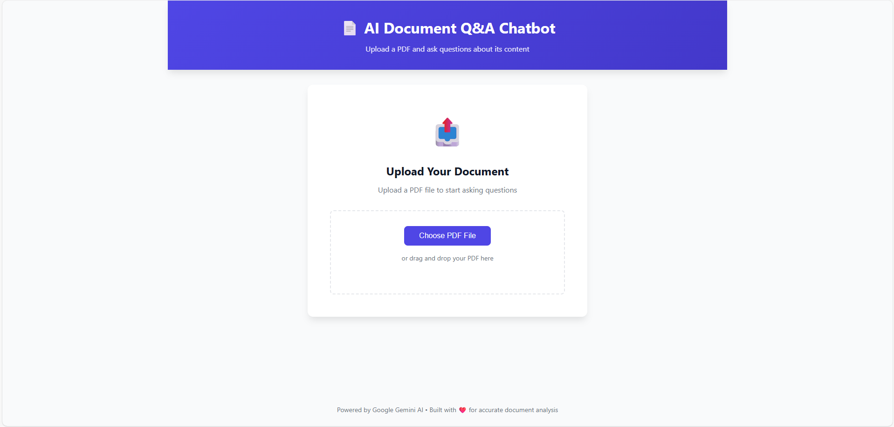
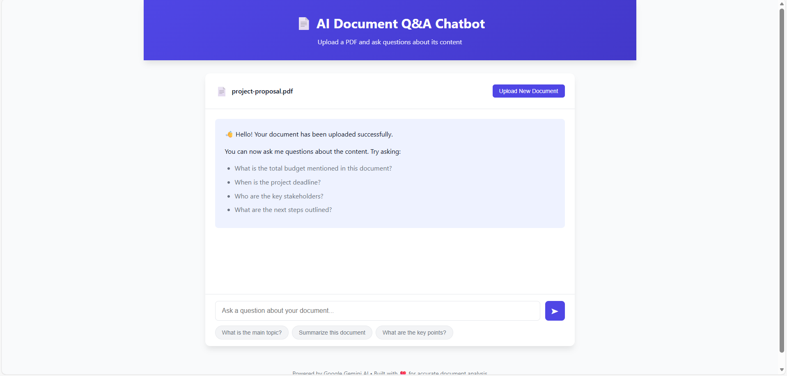
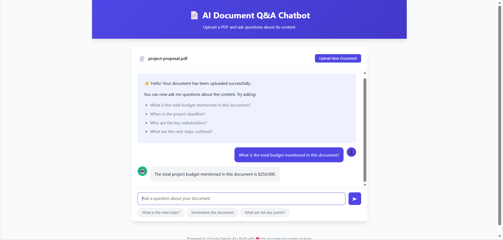

<h1 align="center">AI Document Q&A Chatbot</h1>

---

## Table of Contents
- Overview  
- Features  
- Tech Stack  
- How the System Works  
- Prompt Design and Retrieval Logic  
- Challenges and Edge Cases  
- How to Run the Project  
- Environment Variables  
- Sample Documents  
- Deployment Notes  

---

## Overview
AI Document Q&A Chatbot is a minimal full-stack web application built as part of an internship task. The application allows users to upload a PDF document and chat with it in real time. The AI answers questions strictly based on the document content, such as budgets, deadlines, stakeholders, and next steps, with a strong focus on context accuracy and retrieval correctness.

The backend is implemented using FastAPI, and the AI layer is powered by the Gemini AI API. The frontend provides a simple, clean chat interface for seamless interaction.

---

## Features
The system supports PDF upload, document-aware question answering, real-time chat interaction, and accurate responses grounded only in the uploaded document. It ensures that no responses are hard-coded and all answers are generated through real retrieval and AI inference.

---

## Tech Stack
The backend is built with Python and FastAPI. PDF parsing and chunking are handled server-side, while Gemini AI is used for embeddings and answer generation. The frontend is implemented using HTML, CSS, and JavaScript. A Python virtual environment is used for dependency isolation.

---

## How the System Works
After a PDF is uploaded, the backend extracts text from the document and splits it into manageable chunks. These chunks are processed and used as context for retrieval. When the user asks a question, the most relevant chunks are selected and passed to the Gemini AI model, which generates an answer strictly based on the retrieved document context. The response is then returned to the frontend chat interface.

---

## Prompt Design and Retrieval Logic
The prompt instructs the AI to answer only using the provided document context and to avoid assumptions or external knowledge. Retrieval logic ensures that only the most relevant text chunks are included in each query, improving accuracy and reducing hallucinations.

---

## Challenges and Edge Cases
Key challenges included choosing optimal chunk sizes for PDFs with varying structures and ensuring accurate retrieval when documents contain tables or repeated terms. Additional care was taken to handle empty or ambiguous user questions and large PDF files without degrading performance.

---

## How to Run the Project
First, navigate to the backend directory and create a Python virtual environment. This isolates dependencies and avoids conflicts with global packages.

```bash
cd backend
python -m venv venv

```

Activate the virtual environment depending on your operating system.

```bash
venv\Scripts\activate
```

Once the virtual environment is active, install all required dependencies from the requirements file.

```bash
pip install -r requirements.txt
```

Start the FastAPI backend server.

```bash
python main.py
```

Open a new terminal window for the frontend, navigate to the frontend directory, and start a simple local server.

```bash
cd frontend
python -m http.server 8001
```

Finally, open your browser and go to:

```bash
http://localhost:8001
```

---

## Environment Variables

The Gemini AI API key is stored in a .env file inside the backend directory. This file is loaded at runtime and must not be committed to version control.

---

## Sample Documents

A sample PDF document is included in the repository to demonstrate and test the document question-answering functionality.

---

## Demo
The following images illustrate the workflow of the AI Document Q&A Chatbot:

**1. Main Page – PDF Upload**  
The user can upload a PDF document that will be analyzed for real-time question answering.  



**2. Chat Interface – Interacting with Document**  
After uploading, the chatbot interface allows the user to ask questions and see responses generated from the PDF content.  



**3. Example Question – Accurate Answer**  
The user can ask specific questions about the PDF, and the AI provides correct answers based strictly on the document content.  



---

## Deployment Notes

The application is fully deployable. The backend can be hosted on any environment supporting Python and FastAPI, while the frontend can be served as static files. The architecture allows easy scaling and integration with cloud services.
